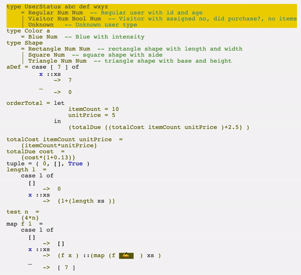
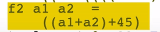

# Supplementary Material for CAS Annual Poster Presentation 

## AST-Based Edit Examples

### Making definitions and function parameters
It is possible to turn an expression into a defintion or a new function parameter

    

### Another example including the use of drop-down menu

    

### Delete
The AST node is deleted and beign replaced by a hole

    

